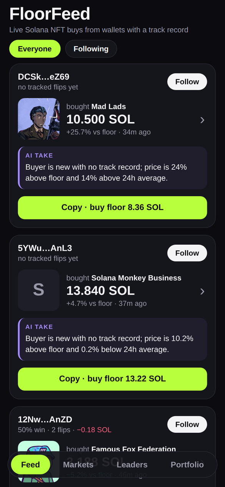
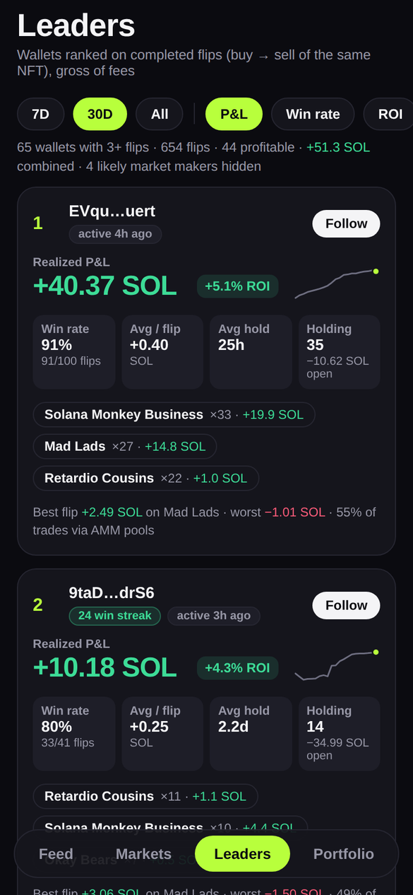
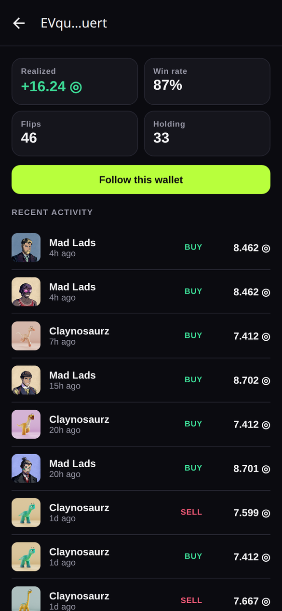
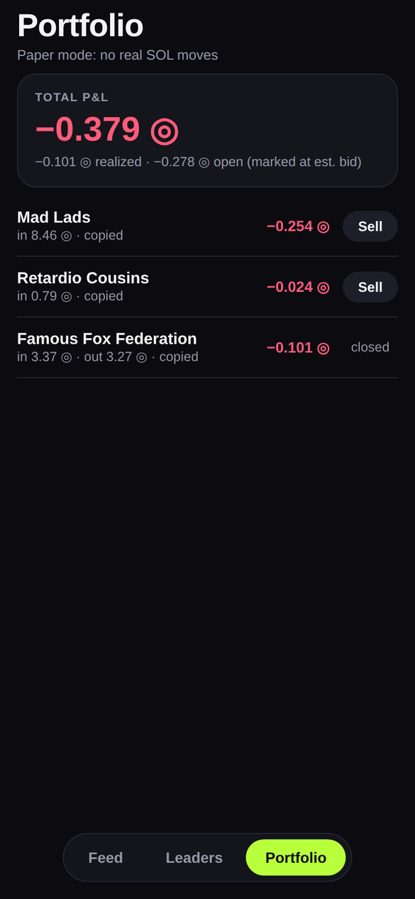
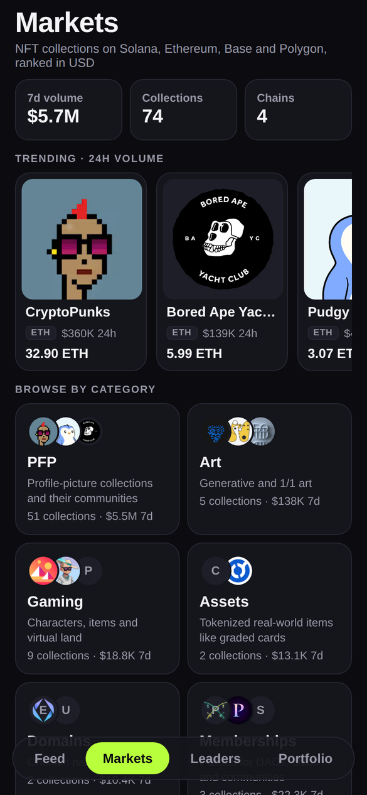
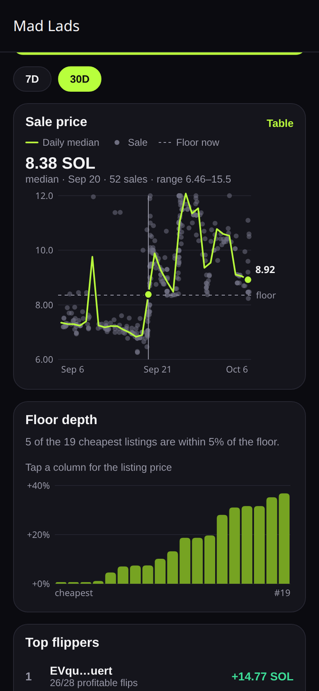
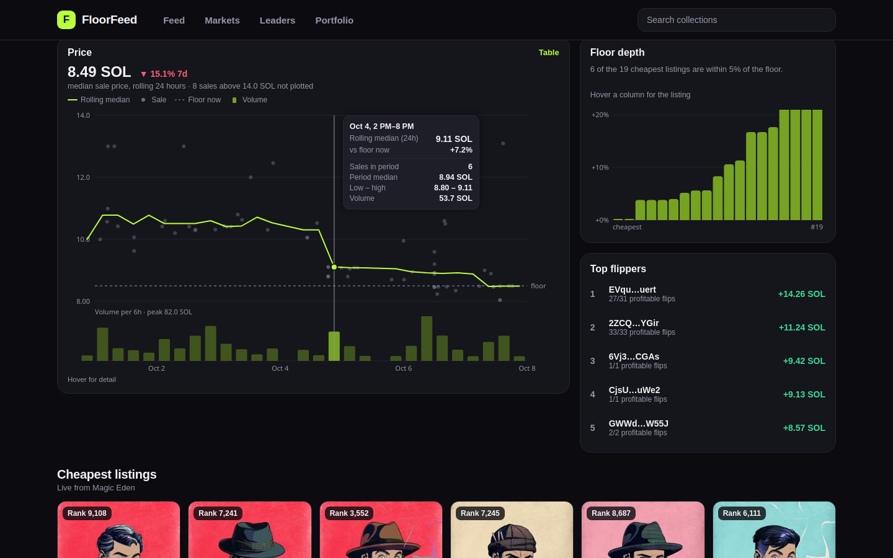
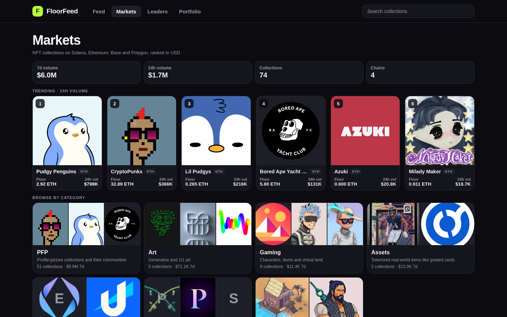
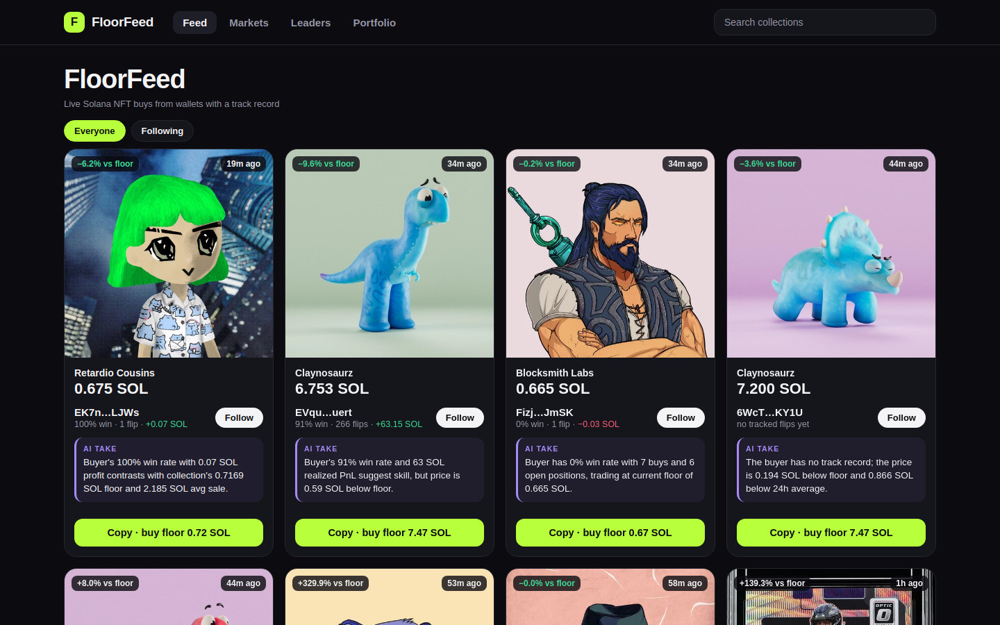
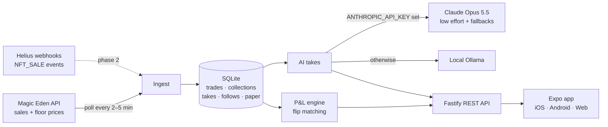

<div align="center">

# FloorFeed

**See what wallets with a real track record are buying in Solana NFTs, get an AI read on each trade, and copy it in one tap.**

A mobile social-trading app modeled on [FOMO](https://fomo.family) (the memecoin app) and rebuilt for NFTs.

### [▶ Live demo: floorfeed.mycodedojo.com](https://floorfeed.mycodedojo.com)
<sub>Paper trading on live Solana mainnet data. Responsive: phone layout on mobile, multi-column layout on desktop.</sub>


<table>
  <tr>
    <td align="center"><br/><sub><b>Feed</b>: live buys + AI takes</sub></td>
    <td align="center"><br/><sub><b>Leaders</b>: ROI, win rate, hold time, streaks</sub></td>
    <td align="center"><br/><sub><b>Wallet</b>: track record + activity</sub></td>
    <td align="center"><br/><sub><b>Portfolio</b>: paper copy-trades</sub></td>
  </tr>
  <tr>
    <td align="center"><br/><sub><b>Markets</b>: 74 collections, 4 chains, 7 categories</sub></td>
    <td align="center" colspan="2"><br/><sub><b>Collection</b>: price history, floor depth, top flippers</sub></td>
    <td></td>
  </tr>
</table>

<br/>
<sub><b>Desktop collection page</b>: rolling-median price chart with a volume panel, floor depth, flippers, and listing art below</sub>

 

<sub>Screenshots show live mainnet data from October 2026.</sub>

</div>

---

## Why this exists

Social trading apps like FOMO made memecoin trading feel like a social feed: you see what good traders buy, follow them, and copy a trade with one tap. They work because **every trade is public on-chain**, so a trader's track record can be checked.

NFT trading has the same public data, but no product like this exists for it. FloorFeed is that product, built as a portfolio project covering three areas:

| | What it shows |
|---|---|
| 📱 **Mobile** | Expo Router with **native tabs** (UITabBar on iOS, Material on Android), a pushed profile screen, haptics, pull-to-refresh, infinite scroll, and a web build from the same codebase |
| 🧠 **AI** | Each trade gets a one-line context note from **Claude**, with server-side refusal fallback and per-trade caching. The same code falls back to a **local Ollama model**, so the demo costs nothing to run |
| ⛓️ **Crypto** | A **multi-chain market**: 74 collections on Solana (Magic Eden), Ethereum, Base and Polygon (OpenSea), ranked in USD and browsable by category (PFP, Art, Gaming, Assets, Domains, Memberships, Utility). Live Solana NFT sales and floor prices, **on-chain wallet P&L** computed by pairing buys and sells of the same mint, a flipper leaderboard, **collection analytics** (30-day sale history, floor depth from live listings, per-collection flippers), and a Helius webhook endpoint for wallet-level tracking |

## How NFTs change the design

NFTs aren't interchangeable the way tokens are, so a straight copy of FOMO doesn't work. These are the decisions that differ:

| | Token app | FloorFeed |
|---|---|---|
| **Copy a trade** | Buy the same token | Buy the **collection floor**, because the exact NFT is already sold |
| **Exit** | Sell into the pool's liquidity | Sell to the **top collection bid** (paper mode: floor − 3% as a stand-in) |
| **Unrealized P&L** | Token price × size | Marked at **estimated bid, not floor**. Floor is what sellers *ask*, not what you'd get, so marking at floor would flatter every position |
| **Trader score** | P&L on a token | P&L on **flips**: a wallet selling a mint it bought earlier |

You can see the result in the Portfolio screenshot: copying at the floor and selling into the bid costs the spread, and the app shows that loss instead of hiding it.

## How it works



**Ingest.** A serial, rate-limited client (Magic Eden's public tier is strict) pulls the latest sales and floor prices for a curated set of liquid collections. Trades are deduplicated by transaction signature.

**P&L engine.** For every sale, SQL finds the seller's most recent earlier buy of the *same mint*. Each matched pair is a flip, and its profit is `sell − buy`. A wallet's win rate, realized P&L and open positions come from those pairs. Open positions are marked against the current floor.

**Leaderboard.** Each wallet's flips are aggregated into a trader profile: realized P&L, **ROI** (profit ÷ cost of the NFTs it flipped), win rate, average profit per flip, **average hold time**, best and worst flip, current win streak, its top collections with per-collection P&L, last activity, and a cumulative P&L sparkline. Leaders can be filtered to 7 days, 30 days or all time, sorted by P&L, win rate, ROI or flip count, and need at least 3 flips to rank, so one lucky trade doesn't top the board. Wallets with ≥60% of their trades through AMM pools (Magic Eden MMM, Tensor) are flagged as **likely market makers** and hidden by default. They trade constantly and would otherwise crowd out the discretionary traders worth following.

**AI takes.** Takes are generated on demand the first time a card is shown, then cached per trade signature. Concurrent requests for the same trade share one in-flight call. The model gets compact JSON (price, floor, 24h average, 7-day volume and the buyer's record) and a system prompt that asks for one specific, numeric sentence and **forbids buy/sell advice**. Claude runs at `low` effort with `fallbacks: "default"`, so a refused request is retried server-side on another model instead of failing. Example:

> *Bought at 8.24 SOL, 2.7% under the 8.46 floor; buyer is 15-for-15 on tracked flips (+8.77 SOL realized), with Mad Lads doing 869 SOL weekly volume.*

**Markets.** Two sources feed one market view. Solana collections come from Magic Eden. Ethereum, Base and Polygon collections come from OpenSea's keyless stats API: floor, owners, supply and 24h/7d/30d volume. Every amount stays in its native currency (SOL, ETH, USDC), and CoinGecko prices convert to USD so collections on different chains can be ranked together. The screen has a 7-day market total, a cross-chain Trending carousel (24h USD volume), a category grid, search, chain and category filters, a device-local ★ watchlist, and sorting by volume, 24h floor change, floor or 24h sales.

To fit inside Magic Eden's strict public rate limit, Solana collections are **tiered**. The top 20 by volume get full sales polling (feed, charts, flippers). The rest get stats only, and their sales load **on demand** when someone opens the collection: the first page right away, then deeper history in the background. All Magic Eden calls go through one **priority queue**, so a user opening a page jumps ahead of background polling.

**Collection analytics.** On first start the server backfills about 30 days of sales per collection, as far back as the public API pages. Magic Eden has no public floor history, so the server records its own floor snapshots from then on. The collection page shows:

- **Sale-price chart:** every sale as a gray dot, with the **daily median** as the one highlighted line and the current floor as a labeled reference. A crosshair snaps to the nearest day, and a table view is one tap away. Rare-trait sales can sit at 2–3× floor and flatten the chart, so the y-axis covers the 2nd–92nd percentile. Sales outside it are **counted in the caption, not pinned to the edge** where they'd look like real prices.
- **Floor depth:** the 20 cheapest listings as columns of "% above floor", which answers "how thin is this floor?" A floor with three listings at 8 SOL and the next at 10 is about to move.
- **Top flippers** scored on that collection's flips only, plus recent sales, all linked to wallet profiles.

The chart colors were checked with a palette validator for contrast and colorblind separation on the dark surface.

**Paper trading.** "Copy · buy floor" opens a position at the live floor price and records which trade inspired it. "Sell" closes it at the estimated bid. No wallet and no SOL are involved.

## Tech stack

| Layer | Choice |
|---|---|
| App | Expo SDK 57, React Native 0.86, React 19, Expo Router (native tabs + stack), expo-image, expo-haptics, React Compiler |
| Server | Node 22, Fastify 5, better-sqlite3 (WAL), Zod validation, tsx |
| AI | Anthropic TypeScript SDK (`claude-opus-5-5`), Ollama HTTP API as a free fallback |
| Data | Magic Eden public API (Solana), OpenSea API v2 (Ethereum, Base, Polygon), CoinGecko (USD prices), Helius enhanced-transaction webhooks |

## Project structure

```
floorfeed/
├── app/                        # Expo app (iOS, Android, web)
│   └── src/
│       ├── app/                # Expo Router routes
│       │   ├── (tabs)/         #   Feed · Leaders · Portfolio (native tabs)
│       │   └── wallet/[address].tsx
│       ├── components/         # TradeCard, PriceChart, DepthChart, Sparkline, tab bars (native + web)
│       ├── constants/brand.ts  # Design tokens (dark-only palette)
│       └── lib/                # API client, session (device id or Privy user), auth, wallets, formatters
│   └── privy/entry.tsx         # Privy sign-in, built separately and loaded on demand
├── server/
│   └── src/
│       ├── index.ts            # REST routes
│       ├── ingest.ts           # Magic Eden polling, history backfill, floor snapshots
│       ├── magiceden.ts        # Rate-limited API client
│       ├── pnl.ts              # Flip matching, wallet stats, leaderboard
│       ├── collections.ts      # Markets list, collection detail, daily aggregation
│       ├── ai.ts               # Claude / Ollama takes with caching
│       ├── db.ts               # SQLite schema
│       └── config.ts           # Env + tracked collections
└── docs/screenshots/
```

## Getting started

**Requirements:** Node 22+. Optionally an [Anthropic API key](https://console.anthropic.com) for Claude takes, or a local [Ollama](https://ollama.com) instance.

```bash
git clone https://github.com/mcooper7649/floorfeed.git
cd floorfeed

# 1. API server
cd server
cp .env.example .env      # add ANTHROPIC_API_KEY, or point OLLAMA_URL at your Ollama
npm install
npm run dev               # http://localhost:8030, starts ingesting right away

# 2. App (in a second terminal)
cd app
cp .env.example .env      # on a phone, set your server's LAN IP
npm install
npx expo start            # w = web, or scan the QR with Expo Go / a dev build
```

The feed fills within about 30 seconds of the server starting. Takes appear as cards are viewed.

### Environment variables

**`server/.env`**

| Variable | Default | |
|---|---|---|
| `PORT` | `8030` | API port |
| `DB_PATH` | `./floorfeed.db` | SQLite file |
| `ANTHROPIC_API_KEY` | none | If set, takes come from Claude |
| `OLLAMA_URL` | `http://localhost:11434` | Used when no Anthropic key is set |
| `OLLAMA_MODEL` | `nimble:latest` | Any instruction-tuned model works |
| `HELIUS_WEBHOOK_SECRET` | none | If set, required as the `Authorization` header on `/webhooks/helius` |
| `OPENSEA_API_KEY` | none | Optional. Makes OpenSea stats reliable (keyless access is intermittent) and is the prerequisite for EVM sales/listings |
| `SOLANA_RPC_URL` | public mainnet RPC | Wallet balances now; sends and simulation later. A Helius URL is recommended |
| `MAGICEDEN_API_KEY` | none | Enables real buys of Magic Eden listings ([plan](docs/WALLET_AND_TRADING.md)) |
| `TENSOR_API_KEY` | none | Enables real buys of Tensor listings |

**`app/.env`**

| Variable | Default | |
|---|---|---|
| `EXPO_PUBLIC_API_URL` | `http://localhost:8030` | Use the server's LAN IP when running on a device |

## API

| Method | Route | Description |
|---|---|---|
| `GET` | `/feed?following=<userId>&before=<unix>` | Recent buys with the buyer's stats and a cached take; `following` filters to followed wallets |
| `GET` | `/takes/:signature` | Generate or return the AI take for a trade |
| `GET` | `/leaderboard?window=7\|30\|all&sort=pnl\|winrate\|roi\|flips&hideMM=1` | Trader profiles (ROI, win rate, hold time, streak, top collections, P&L series) plus a summary |
| `GET` | `/collections` | All 74 collections: chain, currency, category, tier, floor (native + USD), owners/listed, 24h and 7-day volume, floor change, sparkline |
| `GET` | `/collections/:symbol?range=7\|30` | Solana: stats, sales, daily aggregates, floor snapshots, cheapest listings, top flippers. EVM: stats, owners, supply, 30-day volume, floor snapshots |
| `GET` | `/wallets/:address` | A wallet's stats and its 50 most recent trades |
| `GET` | `/follows/:userId` | Wallets a user follows |
| `GET` | `/chain/holdings/:address` | The wallet's NFTs in tracked collections (Helius DAS), marked at est. bid |
| `GET` | `/trade/quote/:symbol?buyer=` | Real buy quote: cheapest listing, buyer balance, whether FloorFeed can execute it |
| `POST` | `/auth/session` | Verify a Privy access token; move this device's data to the account |
| `POST` · `DELETE` | `/follows` | Follow or unfollow a wallet |
| `POST` | `/paper/buy` · `/paper/sell` | Open or close a paper position |
| `GET` | `/paper/:userId` | Positions with realized and unrealized P&L |
| `POST` | `/webhooks/helius` | Ingest `NFT_SALE` events from Helius |

## Self-hosting

The live demo runs on a home server behind Caddy:

```
https://floorfeed.example.com
  ├── /api/*  → API container (prefix stripped)    docker build -t floorfeed-api server
  └── /*      → static web build (any file server)  cd app && EXPO_PUBLIC_API_URL=/api npm run build:web
```

```bash
docker run -d --name floorfeed-api --restart unless-stopped \
  -p 8030:8030 --env-file server/.env -v floorfeed-data:/data floorfeed-api
```

The web export is a single-page app (`web.output: "single"`), so the file server needs to fall back to `index.html` for deep links like `/collection/mad_lads`. SQLite lives in the `floorfeed-data` volume.

## Roadmap

- [x] **Phase 1:** live feed, leaderboard, wallet profiles, AI takes, paper copy-trading
- [x] **Phase 1.5:** Markets tab, collection pages with price history, floor depth and per-collection flippers; live demo deployed
- [x] **Phase 1.6:** multi-chain market (Ethereum, Base, Polygon via OpenSea), categories, trending, search, watchlist; detailed trader leaderboard
- [x] **Phase 1.7:** desktop web layout (top nav with search, multi-column grids, sortable markets table), OpenSea-style collection pages (banner, listing and sales art grids with rarity ranks), rolling-median price chart with volume panel and hover tooltips, 24H range, resized NFT images via image CDNs
- [ ] **Next data sources:** OpenSea key (EVM sales feed, listings, flippers), Tensor key (the other half of Solana volume, real collection bids for instant-sell), Helius (wallet-level tracking, compressed NFTs)
- [ ] **Wallets & real buys (in progress, [plan](docs/WALLET_AND_TRADING.md)):** web wallet connect (Phantom, Solflare, Backpack), balances via Helius, and Privy sign-in (email or Google) with an embedded Solana wallet are live; buys need Magic Eden / Tensor keys
- [ ] **Phase 2:** Helius webhooks per followed wallet, push notifications when a followed wallet buys, Privy sign-in in the native apps
- [ ] **Phase 3:** real trades, devnet first: Tensor / Magic Eden buy-floor and instant-sell-to-bid transactions, signed by the user
- [ ] **Phase 4:** a feed of new mints, "explain my portfolio" chat, EAS builds for TestFlight and Play

## Known limitations

- **P&L only covers what has been ingested.** History before the server started isn't included, so early win rates are based on small samples.
- **P&L is before fees.** Marketplace fees and creator royalties aren't deducted yet.
- **Market-maker detection is a heuristic.** Wallets with ≥60% of their trades through AMM pools are labeled *likely* market makers, and the threshold can misclassify active traders who happen to use pools.
- **Paper sells use floor − 3%,** not a real bid, until Tensor bid data is wired in.
- **Floor vs. listings:** Magic Eden's floor stat can sit slightly below its cheapest regular listing. Depth is measured against the reported floor.
- **EVM collections are stats-only.** OpenSea's keyless API gives collection stats but not sales, listings or rankings, so EVM collections have no sales chart, flippers or paper trading (the paper portfolio is SOL-denominated). Keyless access is also intermittent, so failed refreshes keep the last good values.
- **The collection list is curated, not discovered.** Neither public API offers a usable "top collections" ranking without a key, so the 74 collections are a hand-checked list.
- **Floor history starts at first run.** Sale history is backfilled, but floor snapshots only build up from when the server started.
- **Some NFT image hosts block cross-origin embedding** in the web build, so those collections show a letter placeholder (native apps are unaffected).
- **AI takes are context, not advice.** The prompt rules out buy/sell recommendations, and every number the model sees comes from the API, not from the model's memory.

---

<div align="center"><sub>Built by <a href="https://mycodedojo.com">Michael Cooper</a></sub></div>
