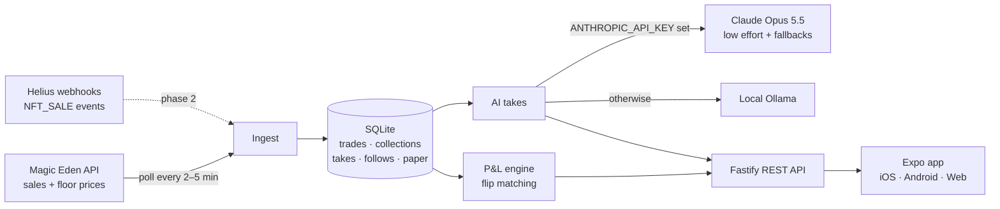

<div align="center">

# FloorFeed

**See what wallets with a real track record are buying in Solana NFTs, get an AI read on each trade, and copy it in one tap.**

A mobile social-trading app modeled on [FOMO](https://fomo.family) (the memecoin app) and rebuilt for NFTs.


<table>
  <tr>
    <td align="center"><br/><sub><b>Feed</b>: live buys + AI takes</sub></td>
    <td align="center"><br/><sub><b>Leaders</b>: ranked by realized P&L</sub></td>
    <td align="center"><br/><sub><b>Wallet</b>: track record + activity</sub></td>
    <td align="center"><br/><sub><b>Portfolio</b>: paper copy-trades</sub></td>
  </tr>
</table>

<sub>Screenshots show live mainnet data from October 2026.</sub>

</div>

---

## Why this exists

Social trading apps like FOMO made memecoin trading feel like a social feed: you see what good traders buy, follow them, and copy a trade with one tap. They work because **every trade is public on-chain**, so a trader's track record can be checked.

NFT trading has the same public data, but no product like this exists for it. FloorFeed is that product, built as a portfolio project covering three areas:

| | What it shows |
|---|---|
| 📱 **Mobile** | Expo Router with **native tabs** (UITabBar on iOS, Material on Android), a pushed profile screen, haptics, pull-to-refresh, infinite scroll, and a web build from the same codebase |
| 🧠 **AI** | Each trade gets a one-line context note from **Claude**, with server-side refusal fallback and per-trade caching. The same code falls back to a **local Ollama model**, so the demo costs nothing to run |
| ⛓️ **Crypto** | Live Solana NFT sales and floor prices, **on-chain wallet P&L** computed by pairing buys and sells of the same mint, a flipper leaderboard, and a Helius webhook endpoint for wallet-level tracking |

## How NFTs change the design

NFTs aren't interchangeable the way tokens are, so a straight copy of FOMO doesn't work. These are the decisions that differ:

| | Token app | FloorFeed |
|---|---|---|
| **Copy a trade** | Buy the same token | Buy the **collection floor**, because the exact NFT is already sold |
| **Exit** | Sell into the pool's liquidity | Sell to the **top collection bid** (paper mode: floor − 3% as a stand-in) |
| **Unrealized P&L** | Token price × size | Marked at **estimated bid, not floor**. Floor is what sellers *ask*, not what you'd get, so marking at floor would flatter every position |
| **Trader score** | P&L on a token | P&L on **flips**: a wallet selling a mint it bought earlier |

You can see the result in the Portfolio screenshot: copying at the floor and selling into the bid costs the spread, and the app shows that loss instead of hiding it.

## How it works



**Ingest.** A serial, rate-limited client (Magic Eden's public tier is strict) pulls the latest sales and floor prices for a curated set of liquid collections. Trades are deduplicated by transaction signature.

**P&L engine.** For every sale, SQL finds the seller's most recent earlier buy of the *same mint*. Each matched pair is a flip, and its profit is `sell − buy`. A wallet's win rate, realized P&L and open positions come from those pairs. Open positions are marked against the current floor.

**AI takes.** Takes are generated on demand the first time a card is shown, then cached per trade signature. Concurrent requests for the same trade share one in-flight call. The model gets compact JSON (price, floor, 24h average, 7-day volume and the buyer's record) and a system prompt that asks for one specific, numeric sentence and **forbids buy/sell advice**. Claude runs at `low` effort with `fallbacks: "default"`, so a refused request is retried server-side on another model instead of failing. Example:

> *Bought at 8.24 SOL, 2.7% under the 8.46 floor; buyer is 15-for-15 on tracked flips (+8.77 SOL realized), with Mad Lads doing 869 SOL weekly volume.*

**Paper trading.** "Copy · buy floor" opens a position at the live floor price and records which trade inspired it. "Sell" closes it at the estimated bid. No wallet and no SOL are involved.

## Tech stack

| Layer | Choice |
|---|---|
| App | Expo SDK 57, React Native 0.86, React 19, Expo Router (native tabs + stack), expo-image, expo-haptics, React Compiler |
| Server | Node 22, Fastify 5, better-sqlite3 (WAL), Zod validation, tsx |
| AI | Anthropic TypeScript SDK (`claude-opus-5-5`), Ollama HTTP API as a free fallback |
| Data | Magic Eden public API (Solana NFT sales + stats), Helius enhanced-transaction webhooks |

## Project structure

```
floorfeed/
├── app/                        # Expo app (iOS, Android, web)
│   └── src/
│       ├── app/                # Expo Router routes
│       │   ├── (tabs)/         #   Feed · Leaders · Portfolio (native tabs)
│       │   └── wallet/[address].tsx
│       ├── components/         # TradeCard, Screen, tab bars (native + web)
│       ├── constants/brand.ts  # Design tokens (dark-only palette)
│       └── lib/                # API client, session (device id → Privy later), formatters
├── server/
│   └── src/
│       ├── index.ts            # REST routes
│       ├── ingest.ts           # Magic Eden polling
│       ├── magiceden.ts        # Rate-limited API client
│       ├── pnl.ts              # Flip matching, wallet stats, leaderboard
│       ├── ai.ts               # Claude / Ollama takes with caching
│       ├── db.ts               # SQLite schema
│       └── config.ts           # Env + tracked collections
└── docs/screenshots/
```

## Getting started

**Requirements:** Node 22+. Optionally an [Anthropic API key](https://console.anthropic.com) for Claude takes, or a local [Ollama](https://ollama.com) instance.

```bash
git clone https://github.com/mcooper7649/floorfeed.git
cd floorfeed

# 1. API server
cd server
cp .env.example .env      # add ANTHROPIC_API_KEY, or point OLLAMA_URL at your Ollama
npm install
npm run dev               # http://localhost:8030, starts ingesting right away

# 2. App (in a second terminal)
cd app
cp .env.example .env      # on a phone, set your server's LAN IP
npm install
npx expo start            # w = web, or scan the QR with Expo Go / a dev build
```

The feed fills within about 30 seconds of the server starting. Takes appear as cards are viewed.

### Environment variables

**`server/.env`**

| Variable | Default | |
|---|---|---|
| `PORT` | `8030` | API port |
| `DB_PATH` | `./floorfeed.db` | SQLite file |
| `ANTHROPIC_API_KEY` | none | If set, takes come from Claude |
| `OLLAMA_URL` | `http://localhost:11434` | Used when no Anthropic key is set |
| `OLLAMA_MODEL` | `nimble:latest` | Any instruction-tuned model works |
| `HELIUS_WEBHOOK_SECRET` | none | If set, required as the `Authorization` header on `/webhooks/helius` |

**`app/.env`**

| Variable | Default | |
|---|---|---|
| `EXPO_PUBLIC_API_URL` | `http://localhost:8030` | Use the server's LAN IP when running on a device |

## API

| Method | Route | Description |
|---|---|---|
| `GET` | `/feed?following=<userId>&before=<unix>` | Recent buys with the buyer's stats and a cached take; `following` filters to followed wallets |
| `GET` | `/takes/:signature` | Generate or return the AI take for a trade |
| `GET` | `/leaderboard` | Wallets ranked by realized flip P&L |
| `GET` | `/wallets/:address` | A wallet's stats and its 50 most recent trades |
| `GET` | `/collections` | Tracked collections with floor, listings and volume |
| `GET` | `/follows/:userId` | Wallets a user follows |
| `POST` · `DELETE` | `/follows` | Follow or unfollow a wallet |
| `POST` | `/paper/buy` · `/paper/sell` | Open or close a paper position |
| `GET` | `/paper/:userId` | Positions with realized and unrealized P&L |
| `POST` | `/webhooks/helius` | Ingest `NFT_SALE` events from Helius |

## Roadmap

- [x] **Phase 1:** live feed, leaderboard, wallet profiles, AI takes, paper copy-trading
- [ ] **Phase 2:** [Privy](https://privy.io) login with embedded Solana wallets (no seed phrase), Helius webhooks per followed wallet, push notifications when a followed wallet buys
- [ ] **Phase 3:** real trades, devnet first: Tensor / Magic Eden buy-floor and instant-sell-to-bid transactions, signed by the user
- [ ] **Phase 4:** a feed of new mints, "explain my portfolio" chat, EAS builds for TestFlight and Play

## Known limitations

- **P&L only covers what has been ingested.** History before the server started isn't included, so early win rates are based on small samples.
- **P&L is before fees.** Marketplace fees and creator royalties aren't deducted yet.
- **Some top wallets aren't people.** Marketplace AMM pools (Magic Eden MMM, Tensor) buy and sell constantly and can rank high. Filtering known pool programs is planned.
- **Paper sells use floor − 3%,** not a real bid, until Tensor bid data is wired in.
- **AI takes are context, not advice.** The prompt rules out buy/sell recommendations, and every number the model sees comes from the API, not from the model's memory.

---

<div align="center"><sub>Built by <a href="https://mycodedojo.com">Michael Cooper</a></sub></div>
